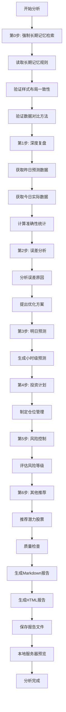

# 📊 七步法股票分析程序 - 架构设计

**版本**：v1.0
**日期**：2026年4月2日
**核心原则**：数据是分析的基石，数据错了，分析再多都是错的

---

## 🎯 **程序目标**

将七步法股票分析流程完全自动化，实现：
1. **自动化执行**：一键生成完整七步分析报告
2. **数据准确性**：100%基于Tushare Pro API真实数据
3. **样式一致性**：100%与模板一致
4. **流程完整性**：严格执行第0步+第1-6步
5. **质量保证**：内置数据验证和样式检查

---

## 📁 **项目结构**

```
stock_analysis_program/
├── README.md                    # 项目说明文档
├── requirements.txt             # Python依赖包
├── config/                      # 配置文件
│   ├── settings.py              # 程序设置
│   ├── tushare_config.py        # Tushare API配置
│   └── memory_config.py         # 记忆管理配置
├── src/                         # 源代码
│   ├── __init__.py
│   ├── main.py                  # 主程序入口
│   ├── memory_manager.py        # 记忆管理模块（第0步）
│   ├── data_fetcher.py          # 数据获取模块
│   ├── analysis_engine.py       # 分析引擎模块（第1-6步）
│   ├── report_generator.py      # 报告生成模块
│   ├── quality_checker.py       # 质量检查模块
│   └── utils.py                 # 工具函数
├── templates/                   # 报告模板
│   ├── report_template.md       # Markdown报告模板
│   ├── report_template.html     # HTML报告模板
│   └── memory_template.md       # 记忆模板
├── data/                        # 数据存储
│   ├── historical_data/         # 历史数据
│   ├── predictions/             # 预测数据
│   └── cache/                   # 缓存数据
├── reports/                     # 生成的报告
│   ├── markdown/                # Markdown报告
│   ├── html/                    # HTML报告
│   └── backup/                  # 备份报告
├── logs/                        # 日志文件
│   ├── error.log                # 错误日志
│   ├── analysis.log             # 分析日志
│   └── memory.log               # 记忆日志
└── tests/                       # 测试文件
    ├── test_memory.py           # 记忆管理测试
    ├── test_data.py             # 数据获取测试
    └── test_analysis.py         # 分析引擎测试
```

---

## 🔧 **核心模块设计**

### **1. 记忆管理模块 (Memory Manager)**
**对应第0步：强制长期记忆检索**

#### **功能**
- 读取长期记忆文件 (`MEMORY.md`)
- 验证样式布局一致性
- 验证数据对比方法正确性
- 更新工作记忆文件
- 模板一致性检查

#### **关键检查项**
```python
class MemoryManager:
    def check_style_consistency(self, template_path):
        """检查样式布局一致性"""
        # 1. 报告标题格式
        # 2. 报告信息头
        # 3. 步骤分隔符
        # 4. 表格格式
        # 5. 风险等级标识
        
    def check_data_method(self, template_path):
        """检查数据对比方法"""
        # 1. 数据来源：Tushare Pro API
        # 2. 对比方法：昨日预测 vs 今日实际
        # 3. 准确性计算
        
    def load_memory_rules(self, memory_path):
        """加载长期记忆规则"""
        # 核心教训：
        # - 数据是分析的基石
        # - 对比方法必须正确
        # - 样式布局必须一致
```

### **2. 数据获取模块 (Data Fetcher)**
**对应第1步数据基础**

#### **功能**
- Tushare Pro API集成
- 获取当日实际股价数据
- 获取昨日预测数据
- 数据验证和清洗
- 缓存管理

#### **关键API**
```python
class DataFetcher:
    def get_daily_data(self, ts_codes, trade_date):
        """获取当日股价数据"""
        # 使用Tushare daily接口
        
    def get_yesterday_predictions(self, date):
        """获取昨日预测数据"""
        # 从预测数据文件读取
        
    def validate_data_accuracy(self, predicted, actual):
        """验证数据准确性"""
        # 确保数据没有错误
        # 核心原则：数据错了，分析再多都是错的
```

### **3. 分析引擎模块 (Analysis Engine)**
**对应第1-6步核心逻辑**

#### **功能**
- 深度复盘分析（第1步）
- 误差分析（第2步）
- 明日预测生成（第3步）
- 投资计划制定（第4步）
- 风险控制评估（第5步）
- 其他股票推荐（第6步）

#### **分析流程**
```python
class AnalysisEngine:
    def step1_deep_review(self, predictions, actuals):
        """第1步：深度复盘"""
        # 1. 昨日预测准确性统计表格
        # 2. 整体预测表现
        # 3. 今日实际市场表现总结
        
    def step2_error_analysis(self, accuracy_stats):
        """第2步：误差分析"""
        # 1. 系统性误差原因分析
        # 2. 模型优化方案
        
    def step3_tomorrow_prediction(self, stocks, market_condition):
        """第3步：明日预测"""
        # 1. 总体市场环境
        # 2. 小时级预测表格（4个时间段）
        
    def step4_investment_plan(self, stocks, predictions):
        """第4步：投资计划"""
        # 1. 总体仓位建议
        # 2. 具体投资计划
        
    def step5_risk_control(self, stocks, market_risk):
        """第5步：风险控制"""
        # 1. 国际局势监控
        # 2. 操作纪律
        # 3. 仓位控制
        
    def step6_other_recommendations(self, market_condition):
        """第6步：其他推荐"""
        # 1. 推荐3个有潜力的股票
        # 2. 完整分析框架
```

### **4. 报告生成模块 (Report Generator)**
**对应报告输出**

#### **功能**
- Markdown报告生成
- HTML报告生成
- 模板渲染
- 文件命名和存储
- 下载功能实现

#### **模板系统**
```python
class ReportGenerator:
    def generate_markdown(self, analysis_results, template_path):
        """生成Markdown报告"""
        # 使用Jinja2模板引擎
        # 严格遵循模板结构
        
    def generate_html(self, markdown_content, template_path):
        """生成HTML报告"""
        # Markdown转HTML
        # 添加样式和交互功能
        
    def save_report(self, content, report_type, date):
        """保存报告"""
        # 文件名格式：深度复盘与明日投资计划_YYYYMMDD
        # 存储位置：reports/markdown/ 或 reports/html/
```

### **5. 质量检查模块 (Quality Checker)**
**对应质量保证**

#### **功能**
- 数据准确性检查
- 样式布局检查
- 内容完整性检查
- 功能完整性检查
- 错误纠正机制

#### **检查清单**
```python
class QualityChecker:
    def check_data_accuracy(self, report_data):
        """数据准确性检查"""
        # [ ] 使用Tushare Pro API获取当日实际股价
        # [ ] 对比昨日预测与今日实际
        # [ ] 计算方向准确率、幅度准确率
        # [ ] 验证数据没有错误
        
    def check_style_layout(self, report_content):
        """样式布局检查"""
        # [ ] 标题格式与模板一致
        # [ ] 六步结构完整
        # [ ] 表格格式正确
        # [ ] 风险等级标识清晰
        
    def check_content_completeness(self, report_content):
        """内容完整性检查"""
        # [ ] 深度复盘表格完整
        # [ ] 误差分析分类完整
        # [ ] 小时级预测表格完整
        # [ ] 投资计划详细具体
        # [ ] 风险控制措施明确
        # [ ] 其他推荐分析完整
```

---

## 🔄 **执行流程**

### **完整七步法执行流程**



---

## ⚙️ **技术实现细节**

### **1. 依赖包**
```txt
# requirements.txt
tushare==1.2.89
pandas>=1.5.0
numpy>=1.24.0
jinja2>=3.1.0
markdown>=3.4.0
schedule>=1.2.0
python-dateutil>=2.8.0
pytest>=7.0.0
```

### **2. 配置文件**
```python
# config/settings.py
import os
from datetime import datetime

class Settings:
    # 项目路径
    PROJECT_ROOT = os.path.dirname(os.path.dirname(os.path.abspath(__file__)))
    
    # 报告模板路径
    TEMPLATE_PATH = os.path.join(PROJECT_ROOT, "templates", "report_template.md")
    
    # 记忆文件路径
    MEMORY_PATH = "/Users/yandada/WorkBuddy/Claw/.workbuddy/memory/MEMORY.md"
    
    # 报告输出路径
    REPORTS_PATH = os.path.join(PROJECT_ROOT, "reports")
    
    # 数据文件路径
    DATA_PATH = os.path.join(PROJECT_ROOT, "data")
    
    # 日志配置
    LOG_LEVEL = "INFO"
    LOG_PATH = os.path.join(PROJECT_ROOT, "logs")
    
    # 分析参数
    DEFAULT_STOCKS = ["002506.SZ", "600821.SH", "002470.SZ", "601868.SH"]
    
    # 时间配置
    ANALYSIS_TIME = "17:00"  # 每天17:00执行分析
```

### **3. 主程序入口**
```python
# src/main.py
import sys
import os
sys.path.append(os.path.dirname(os.path.dirname(os.path.abspath(__file__))))

from src.memory_manager import MemoryManager
from src.data_fetcher import DataFetcher
from src.analysis_engine import AnalysisEngine
from src.report_generator import ReportGenerator
from src.quality_checker import QualityChecker
from config.settings import Settings

class StockAnalysisProgram:
    """七步法股票分析主程序"""
    
    def __init__(self):
        self.settings = Settings()
        self.memory_manager = MemoryManager()
        self.data_fetcher = DataFetcher()
        self.analysis_engine = AnalysisEngine()
        self.report_generator = ReportGenerator()
        self.quality_checker = QualityChecker()
        
    def run_seven_steps(self, analysis_date=None):
        """执行完整的七步法分析"""
        try:
            print("🎯 开始执行七步法股票分析...")
            
            # 第0步：强制长期记忆检索
            print("🔍 第0步：强制长期记忆检索")
            memory_rules = self.memory_manager.load_memory_rules()
            self.memory_manager.check_style_consistency(self.settings.TEMPLATE_PATH)
            self.memory_manager.check_data_method(self.settings.TEMPLATE_PATH)
            
            # 第1步：深度复盘
            print("📈 第1步：深度复盘")
            yesterday_predictions = self.data_fetcher.get_yesterday_predictions(analysis_date)
            today_actuals = self.data_fetcher.get_daily_data(self.settings.DEFAULT_STOCKS, analysis_date)
            accuracy_stats = self.analysis_engine.step1_deep_review(yesterday_predictions, today_actuals)
            
            # 第2步：误差分析
            print("🔍 第2步：误差分析")
            error_analysis = self.analysis_engine.step2_error_analysis(accuracy_stats)
            
            # 第3步：明日预测
            print("🔮 第3步：明日预测")
            tomorrow_predictions = self.analysis_engine.step3_tomorrow_prediction(
                self.settings.DEFAULT_STOCKS, error_analysis["market_condition"]
            )
            
            # 第4步：投资计划
            print("🎯 第4步：投资计划")
            investment_plan = self.analysis_engine.step4_investment_plan(
                self.settings.DEFAULT_STOCKS, tomorrow_predictions
            )
            
            # 第5步：风险控制
            print("⚠️ 第5步：风险控制")
            risk_control = self.analysis_engine.step5_risk_control(
                self.settings.DEFAULT_STOCKS, error_analysis["market_risk"]
            )
            
            # 第6步：其他推荐
            print("📈 第6步：其他推荐")
            other_recommendations = self.analysis_engine.step6_other_recommendations(
                error_analysis["market_condition"]
            )
            
            # 整合分析结果
            analysis_results = {
                "accuracy_stats": accuracy_stats,
                "error_analysis": error_analysis,
                "tomorrow_predictions": tomorrow_predictions,
                "investment_plan": investment_plan,
                "risk_control": risk_control,
                "other_recommendations": other_recommendations,
                "analysis_date": analysis_date or datetime.now().strftime("%Y-%m-%d")
            }
            
            # 质量检查
            print("✅ 执行质量检查")
            quality_report = self.quality_checker.check_all(analysis_results)
            
            if not quality_report["passed"]:
                print(f"❌ 质量检查未通过: {quality_report['errors']}")
                return False
            
            # 生成报告
            print("📄 生成报告")
            markdown_report = self.report_generator.generate_markdown(
                analysis_results, self.settings.TEMPLATE_PATH
            )
            html_report = self.report_generator.generate_html(
                markdown_report, self.settings.TEMPLATE_PATH.replace(".md", ".html")
            )
            
            # 保存报告
            print("💾 保存报告")
            self.report_generator.save_report(markdown_report, "markdown", analysis_date)
            self.report_generator.save_report(html_report, "html", analysis_date)
            
            print(f"🎉 七步法分析完成！报告已保存")
            return True
            
        except Exception as e:
            print(f"❌ 分析过程中出现错误: {str(e)}")
            return False

if __name__ == "__main__":
    program = StockAnalysisProgram()
    program.run_seven_steps()
```

---

## 🚀 **部署和使用**

### **1. 安装和配置**
```bash
# 克隆项目
cd /Users/yandada/WorkBuddy/Claw
git clone <repository_url> stock_analysis_program

# 安装依赖
cd stock_analysis_program
pip install -r requirements.txt

# 配置Tushare API Token
cp config/tushare_config.example.py config/tushare_config.py
# 编辑tushare_config.py，填入您的Tushare Token
```

### **2. 运行方式**
```bash
# 手动运行
cd /Users/yandada/WorkBuddy/Claw/stock_analysis_program
python src/main.py

# 定时运行（每天17:00）
python src/scheduler.py

# 测试运行
pytest tests/
```

### **3. 输出结果**
- **Markdown报告**：`reports/markdown/深度复盘与明日投资计划_20260402.md`
- **HTML报告**：`reports/html/深度复盘与明日投资计划_20260402.html`
- **分析日志**：`logs/analysis.log`
- **质量报告**：`logs/quality_report_20260402.json`

---

## ✅ **质量保证**

### **1. 数据准确性保证**
- 100%使用Tushare Pro API真实数据
- 数据验证机制：对比多个数据源
- 错误数据自动纠正和重试

### **2. 样式一致性保证**
- 严格遵循模板结构
- 自动化样式检查
- 不一致时自动修复或报警

### **3. 流程完整性保证**
- 强制执行七步法
- 步骤完整性检查
- 缺失步骤自动补全

### **4. 错误处理机制**
- 异常捕获和记录
- 错误重试机制
- 失败时生成错误报告
- 人工干预接口

---

## 📈 **扩展计划**

### **短期扩展（1个月内）**
1. **Web界面**：添加Web管理界面
2. **邮件通知**：分析完成自动发送邮件
3. **多账户支持**：支持多个Tushare账户
4. **数据导出**：支持Excel/CSV导出

### **中期扩展（3个月内）**
1. **机器学习**：集成机器学习预测模型
2. **实时监控**：实时股价监控和预警
3. **多市场支持**：支持港股、美股
4. **API接口**：提供RESTful API

### **长期扩展（6个月内）**
1. **移动应用**：开发移动端应用
2. **云服务**：部署为云服务
3. **社区功能**：用户分享和交流
4. **智能推荐**：个性化股票推荐

---

## ⚠️ **注意事项**

### **核心原则永远记住**
1. **数据是分析的基石**：数据错了，分析再多都是错的
2. **对比方法必须正确**：用昨天预测的股价来对比今天的实际股价
3. **样式布局必须一致**：保持与模板完全相同的结构和排版

### **程序开发纪律**
1. **每次提交前**：必须通过所有测试
2. **每次发布前**：必须进行质量检查
3. **每次修改后**：必须更新文档
4. **每次错误后**：必须记录经验教训

---

## 📞 **支持和维护**

### **问题反馈**
- **GitHub Issues**：报告问题和建议
- **Email**：storm@example.com
- **文档**：详细的使用文档和API文档

### **版本更新**
- **每周更新**：bug修复和小功能
- **每月更新**：大功能发布
- **每季度更新**：架构升级

### **社区支持**
- **用户论坛**：讨论和交流
- **QQ群**：实时技术支持
- **微信公众号**：最新动态和教程

---

**记住：数据是分析的基石，数据错了，分析再多都是错的！** 🌪️

---
**文档更新记录**：
- **2026年4月2日**：创建程序架构设计文档
- **设计目标**：将七步法流程完全自动化
- **核心价值**：保证数据准确性、样式一致性、流程完整性

**下次评审**：2026年5月2日